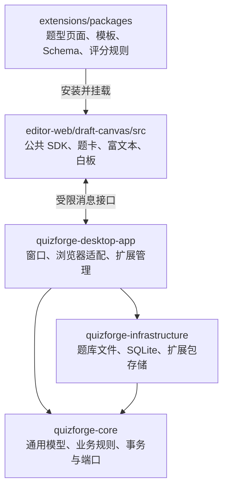

# QuizForge V2 代码地图与业务链路

本指南按当前生产代码整理。阅读顺序是：认识模块 → 选择一条业务链路 → 找到需要修改的层。运行步骤见 [新人指南](new-developer-guide.md)，新增题型见 [五步模板](templates/new-question-type.md)。

## 1. 模块和依赖



Java 编译依赖为 `desktop → infrastructure → core`，桌面模块也直接依赖 core。Core 使用 `port` 中的接口访问外部能力，由 infrastructure 提供实现；Core 不依赖 JavaFX、WebView2 或文件存储实现。

| 位置 | 负责什么 | 修改场景 |
| --- | --- | --- |
| `quizforge-core/src/main/java/io/quizforge/core/question` | 通用题目模型、题型契约、题库编辑规则、内容与资源引用 | 修改通用数据结构、题库校验或题目操作 |
| `quizforge-core/src/main/java/io/quizforge/core/practice` | 作答状态、提交、重试、统计、草稿和历史快照 | 修改练习业务或持久化事务规则 |
| `quizforge-core/src/main/java/io/quizforge/core/port` | 存储、事务、文件与资源访问接口 | 定义业务需要的外部能力 |
| `quizforge-infrastructure/src/main/java/io/quizforge/infrastructure/filesystem/qbank` | `.qbank` ZIP/JSON 读写、资源读取与文件发布 | 修改题库文件协议 |
| `quizforge-infrastructure/src/main/java/io/quizforge/infrastructure/persistence/practice` | SQLite 仓库、事务、草稿序列化与 runtime 创建 | 修改作答或历史的实际存储 |
| `quizforge-infrastructure/src/main/java/io/quizforge/infrastructure/extension` | 扩展包校验、版本存储、开发目录读取 | 修改安装包或开发源码加载 |

`asset`、`document`、`workspace` 等 Core 包分别提供资产索引、文档与工作区业务。它们服务于题库导航、引用和文件管理；修改题型通常不需要进入这些包。

### 保留下来的题型数据为何还在 Core

题型执行通过已安装扩展接入。`question/type` 只保留题型接口、登记与扩展执行适配，不再按旧题型放置数据类：

```text
question/
├─ model/                   通用题目数据
│  ├─ choice/               当前扩展共用的 CHOICE 数据契约
│  └─ extension/            扩展拥有的不可变 JSON 数据
├─ content/                 文本、富文本、文档内容与读取辅助
├─ codec/                   页面、模板和快照共用的 JSON 编解码
└─ type/                    题型契约、目标、校验上下文、登记表
   └─ extension/            扩展规则接口、执行适配与缺失扩展提示
```

| 位置或类 | 保留原因 |
| --- | --- |
| `question/model/choice/ChoicePayload`、`ChoiceAnswerSpec`、`ChoiceOption` | 当前单选、多选、判断扩展使用持久化 `CHOICE` 结构；此处不实现题型页面或评分规则 |
| `question/model/extension/ExtensionPayload`、`ExtensionAnswerSpec` | 新扩展的不可变 JSON 数据；不依赖题型专属 Java 类 |
| `question/codec/QuestionDataCodec` | 原 `BuiltinQuestionData`，名称与职责统一；共用 JSON 编码只支持 `CHOICE` 与 `EXTENSION` 封装，选择类编辑使用 `CHOICE` 通道 |
| `question/content/QuestionText` | 纯文本读取与可显示内容检测 |
| `practice/MatchingPracticeAnswer`、`TranslationPracticeAnswer`、`EssayPracticeAnswer` | 旧历史记录的答案解码；作文记录还提供已有富文本文档的数据格式和大小限制 |
| `ui/question/history/LegacyChoiceAnswerDecoder` | 读取旧历史的选项 ID 列表 |

旧题型的 `question/compat` 数据类、文件解码分支及失效测试已删除。旧的专项 kind 文件需要手动迁移为 EXTENSION.data；应用不会删除或自动重写用户文件。新增题型按扩展 SDK 编写模板、页面、Schema 和规则，不在 Core 增加题型专属实现。

`QuestionBankPracticeSession` 仅提供导航和大纲状态，由 `PracticeRuntimeMapper` 从成功的快照恢复；它不再保存选择、匹配、翻译等题型私有答案，也不自行评分。新增题型使用通用 `PracticePayload` 和扩展规则，不增加宿主专项入口。

## 2. 桌面代码的职责边界

以下位置均在 `quizforge-desktop-app/src/main/java/io/quizforge/desktop/` 下。

```text
desktop/
├─ bootstrap/               应用启动与依赖装配
├─ ui/                      工作区、文件、编辑、练习和历史界面
├─ learning/                浏览器共用的练习适配与显示模型
├─ browser/
│  ├─ PracticeLearningSurface.java   练习页面接口
│  ├─ HistoryLearningSurface.java    历史页面接口
│  ├─ webview2/             Windows 原生浏览器与消息适配
│  └─ javafx/               JavaFX 练习页面与操作队列
├─ extension/               安装登记、权限、规则进程、开发调试
├─ dev/                     主程序开发热更新
└─ poc/sharedpractice/      独立演示启动器及演示数据装配
```

| 文件 | 当前职责 |
| --- | --- |
| `learning/SharedPracticeAdapter.java` | 把页面意图交给 Core，维护最近一次成功的练习快照；不负责浏览器加载 |
| `learning/SharedPracticeViewModel.java` | 把练习或历史快照投影成通用题卡 DTO；未提交时隐藏答案、评分标准及解析 |
| `learning/SharedContent.java` | 根据冻结资源解析文本、富文本、文档和图片显示数据；不改写原始题目数据 |
| `browser/webview2/WebView2PracticeSession.java` | 接收浏览器消息，验证身份与操作序号，在业务队列中调用练习适配器 |
| `browser/webview2/WebView2LearningSurface.java` | 原生练习页面、导航、生命周期与关闭前保存 |
| `browser/javafx/SharedPracticeCanvasWebView.java` | JavaFX WebView 的练习页面实现；同样通过共用适配器访问 Core |
| `browser/javafx/PracticeMutationQueue.java` | JavaFX 页面内部的操作序号检查和 FIFO 队列，不作为跨后端公共 API |
| `ui/question/practice/PracticeSurfaceHost.java` | 练习/草稿模式、界面状态与浏览器后端选择 |
| `ui/question/history/HistorySurfaceHost.java` | 只读历史界面、尝试导航与后端选择 |
| `ui/question/extension/ExtensionEditorFields.java` | 扩展编辑页面、草稿 flush 与公共富文本接入 |

Windows 正式页面默认选择 WebView2。JavaFX 兼容实现仍有调用：练习实现已经归入 `browser/javafx`，历史实现目前仍在 `ui/question/history/HistoryDraftWebView`，编辑适配仍在 `ExtensionEditorFields`。这些位置是后续统一后端组织时的入口。

`poc/sharedpractice` 只保留 `SharedPracticeExample` 和 `SharedPracticeCanvasLauncher`，供独立演示与测试夹具使用。正式界面和浏览器后端不依赖这个包。

## 3. 五条业务链路

### 打开题库

`ui/file/FilePresentationLoader` 加载文件呈现数据，题库读取由 `QBankPackageReader` / `QuestionBankV2Codec` 处理；`FileViewerRouter` 创建练习视图，`QuestionBankFileView` 管理浏览、编辑和历史页面之间的切换。

资源由 `QuestionResourceInput` 提供，不要求题型页面自行读取本地文件。缺少扩展时使用 `MissingExtensionQuestionType` 保留数据，界面提示不可用。

### 编辑并保存题库

`QuestionBankEditorView` → `ExtensionEditorFields` → 页面 flush → `QuestionBankEditorModel` → `QuestionBankFileEditService` → `QuestionBankFileStorage` → `LocalQuestionBankFileStorage` / `QBankPackageWriter`。

页面输入先更新编辑草稿；正式保存还要校验题目、检查题库是否被外部修改，再发布题库文件并更新索引。编辑草稿、磁盘题库和练习答案是不同的状态，排查保存问题时先确认是哪一条链路。

### 作答并提交

扩展 practice 页面 → `QF.save draft/submit` → `simple-client.js / simple-api.js` → 网页 runtime 与浏览器消息适配 → `SharedPracticeAdapter` → `PersistentPracticeRuntime` / `PracticeSessionService` → `SqlitePracticeTransaction`。旧包的页面 API 已停止支持。

题型规则由 `ExternalQuestionTypeDefinition` 调用 `ExtensionRuleRuntime` 执行；规则进程受沙箱约束，主程序校验返回结果。页面不直接操作数据库，也不拥有最终评分和提交状态。确认成功后，宿主以新的 `SharedPracticeViewModel` 刷新题卡。

### 草稿与历史

白板 `canvas` 产生 `DraftCanvasDocument`，页面发送有序操作，宿主保存到 `SqliteActiveDraftCanvasRepository`。提交时，Core 把相应草稿冻结到尝试快照。

历史读取由 `PracticeHistoryService` 提供，`HistoryDraftAdapter` 组织题卡与笔迹，`HistorySurfaceHost` 交给只读浏览器页面。`SharedPracticeViewModel` 投影冻结的题目、资源与作答；历史不能写回当前答案。

### 安装或开发扩展

`ExtensionManagementDialog` → `ExtensionManager` → `ExtensionPackageStore` → 用户确认权限 → 登记 `QuestionTypes` 与固定版本的规则、页面。

`ExtensionManager.initialize` 在后台检查安装包，回到 JavaFX 线程登记版本和页面，完成时不会创建规则进程。`ExtensionRuleRuntime` 在首次规则调用时启动对应版本的隔离环境；历史冻结版本同样按需启动。同一宿主生命周期复用准备后的沙箱运行文件，宿主重启后重新检查运行依赖。

应用不自动安装或授权示例题型。加载开发目录是显式操作，`ExtensionLiveDevelopment` / `ExtensionDevelopmentWatcher` 管理页面变更；正式评分继续使用安装版本。修改扩展接口还应检查 `ExtensionPageBridge`、规则协议和相应的沙箱实现。

## 4. 网页源码与生成文件

网页源码根目录是 `quizforge-desktop-app/editor-web/draft-canvas/`。

| 源码 | 职责 |
| --- | --- |
| `src/extensions/html-ui.js`、`sdk.js` | 扩展页面挂载、QF 接口和编辑 flush |
| `src/extensions/simple-client.js`、`simple-api.js` | SDK 2.3 加载/保存/操作、请求身份、离开屏障和白名单 |
| `src/extensions/frame-client.js` | 隔离页实际公开的 QF 对象及公共内容组件 |
| `src/extensions/rules-runtime.js` | 规则包装、模板、ID 与评分结果验证 |
| `src/extensions/schema-worker.js` | 页面数据校验 Worker |
| `src/shared/renderer/registry.js` | 安装扩展的渲染登记 |
| `src/shared/runtime/question-runtime.js` | 作答操作顺序、提交确认和重试 |
| `src/webview2-*-app.js` | WebView2 编辑、练习、历史页面的宿主适配 |
| `src/canvas/`、`src/learning/`、`src/history-replay.js` | 公共白板、模式和历史重放 |
| `src/extensions/workbench-app.js`、`preview.js` | 开发测试窗口和只读预览 |

`scripts/build.mjs` 将源码构建到 `quizforge-desktop-app/src/main/resources/editor/draft-canvas/`。修改行为时编辑源码，再构建；直接修改生成的 JS/CSS 会在下次构建时被覆盖。

题型源码位于 `extensions/packages/`，当前有八种外部示例，均使用 SDK 2.3 并附真实 .qbank 样例。判断题 2.3.2 直接维护 JS，其余七型 2.3.2 修改 *-source.js/shared 后由 build-page-extensions.mjs 构建。pack.mjs 可独立打包；scripts/build-extensions.mjs 生成预览分发物。具体入口见 [源码目录](../extensions/packages/README.md)，接口见 [现行参考](../extensions/SIMPLE_PAGE_API.md)。

## 5. 按任务定位修改位置

| 任务 | 从哪里开始 |
| --- | --- |
| 新增题型 | [五步模板](templates/new-question-type.md) → [完整开发指南](../extensions/DEVELOPMENT_GUIDE.md)；一般不修改 Java 主程序 |
| 修改某题型的题干、选项或作答界面 | 判断题改 editor.js/practice.js；其余型改 *-source.js/shared 后构建 |
| 修改题型校验或评分 | 手写规则改 type.js，构建式规则改 type-source.js/shared；同步 Schema，发布增加包版本 |
| 修改所有题型共用的富文本、白板或公共按钮 | 网页公共组件与对应宿主接口 |
| 答案重启后丢失、提交失败 | 第 3 节作答链路：消息确认、Core 事务、SQLite |
| 题库保存失败、资源丢失 | 第 3 节编辑链路：flush、资源输入、文件发布 |
| 原生窗口、消息传输或关闭问题 | `browser/webview2` 与相应 `PracticeLearningSurface` / `HistoryLearningSurface` 实现 |
| 扩展权限、规则超时或进程退出 | `extension` 运行时、进程协议与沙箱 |

增加共用能力时按已有层次接入：数据和业务放 Core，外部存储放 infrastructure，界面与浏览器适配放 desktop，题型私有交互放扩展。正式业务代码应放在职责对应的包中，`poc` 仅用于独立演示。
