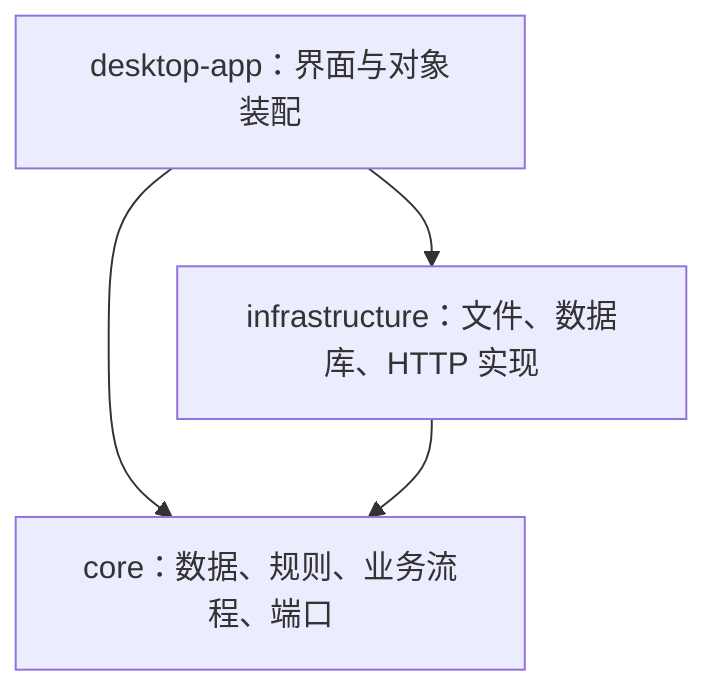

# QuizForge V2 新人技术指南

本文以 **2026-10-03 的实际代码** 为准，介绍项目的模块分工、题库数据、编辑与练习流程，以及新增题型的固定步骤。

建议按以下顺序阅读：先看第 1～3 节建立项目地图，再看第 4～5 节理解数据和调用流程，第一次新增题型时按第 6 节逐步操作。需要查某个文件的完整职责时，使用 [逐文件代码导读](C:/Users/wangg/OneDrive/Desktop/QuizForge/quizforge_V2/docs/code-guide.md)。

当前已实现单选、多选、作文、完形填空、阅读理解、段落匹配和翻译题。下文的 `TRUE_FALSE` 判断题是教学示例，尚未加入正式题型登记。

Practice Draft Mode v1：正式单选题浏览区右上角“草稿 / 退出草稿”原地切换 JavaFX 与 Draft Canvas。`PracticeSurfaceHost` 只管理当前页的 NORMAL/DRAFT；共享卡片通过同一 `PersistentPracticeRuntime` 读取和修改 Core + SQLite 状态，退出与切题等待草稿保存确认。逐题隔离、提交冻结与生命周期说明见 [Practice Draft Mode](C:/Users/wangg/OneDrive/Desktop/QuizForge/quizforge_V2/quizforge-desktop-app/editor-web/draft-canvas/PRACTICE_DRAFT_MODE.md)。

History Draft Replay v1：正式历史详情的 `HistorySurfaceHost` 原地切换 RESULT/DRAFT；`HistoryDraftAdapter → PracticeHistoryService.loadDraftReplay → AttemptDraftSnapshotRepository.find(attemptId)` 组合冻结题目、当次答案/得分和草稿。Active Draft 是可变工作状态，Attempt Snapshot 是不可变历史，Replay 是只读投影。History bridge 只有 ready，无 Practice mutation 或自动保存。参见 [History Replay 架构](C:/Users/wangg/OneDrive/Desktop/QuizForge/quizforge_V2/quizforge-desktop-app/editor-web/draft-canvas/HISTORY_DRAFT_REPLAY.md)。两种正式 Canvas 模式均支持 SINGLE_CHOICE / MULTIPLE_CHOICE + TEXT，其他五种题型尚未迁移。Shared Runtime 经静态 QuestionRendererRegistry 选择两种题型定义；Choice family 共用布局，以 SINGLE radio / MULTIPLE checkbox 收集 selectedOptionIds。Renderer 负责交互与展示，Core QuestionTypeDefinition 负责业务数据与规则，二者不是同一合同。详见 [Shared Renderer Contract](C:/Users/wangg/OneDrive/Desktop/QuizForge/quizforge_V2/quizforge-desktop-app/editor-web/draft-canvas/SHARED_RENDERER_CONTRACT.md) 与 [本阶段验收](C:/Users/wangg/OneDrive/Desktop/QuizForge/quizforge_V2/quizforge-desktop-app/editor-web/draft-canvas/SHARED_RENDERER_ACCEPTANCE.md)。

## 1. 先运行项目

### 1.1 环境和启动入口

当前是以 Windows 为主要运行环境的 JavaFX 桌面应用，没有需要单独启动的业务 Web 后端。Spring 在桌面进程内负责创建和连接对象。

| 场景 | 所需环境 | 使用方式 |
| --- | --- | --- |
| 编译、普通启动 | JDK 21、Maven | 双击根目录的 `Start-QuizForge.cmd` |
| Java 开发热更新 | 支持增强类重定义的 JBR 21、Maven | 启动 `Start-QuizForge-LiveUi.cmd`；完整 LiveUi 同时需要下面的前端环境 |
| 修改 Canvas 前端或启用 LiveWeb | 能运行项目 Vite 版本的 Node.js、npm，以及已安装的前端依赖 | 在 Canvas 源码目录执行 `npm ci`，按需 `npm run build` |

从 `quizforge_V2` 根目录执行：

```powershell
# 普通启动：使用已经打包的 Canvas 页面
.\Start-QuizForge.cmd

# 第一次准备前端开发依赖
Set-Location quizforge-desktop-app/editor-web/canvas
npm ci
Set-Location ../../..

# 开发启动：Java、CSS、Canvas 前端热更新
.\Start-QuizForge-LiveUi.cmd
```

两个 `.cmd` 共用 [tools/Start-QuizForge.ps1](C:/Users/wangg/OneDrive/Desktop/QuizForge/quizforge_V2/tools/Start-QuizForge.ps1)。启动实现负责 Maven 编译、JavaFX 启动、日志和开发子进程的清理。普通启动不需要 Node/npm；只修改 Java 或 CSS 时也可单独传入 `-LiveJava`、`-LiveCss`。

普通启动会先用 `target/launcher` 编译输出安装项目模块，再运行桌面模块。运行日志在 `%LOCALAPPDATA%\QuizForge\logs`。热更新不是所有改动都能原地生效：依赖、Spring 装配、启动配置、数据库迁移等变化需要重启。详细说明见 [开发热更新文档](C:/Users/wangg/OneDrive/Desktop/QuizForge/quizforge_V2/docs/development-live-update.md)。

### 1.2 先认识源码和生成文件

```text
quizforge_V2/
  pom.xml                      三个 Maven 模块及统一依赖版本
  Start-QuizForge.cmd           普通启动入口
  Start-QuizForge-LiveUi.cmd    开发启动入口
  quizforge-core/              题目、规则和业务流程
  quizforge-infrastructure/    文件、JSON/ZIP、SQLite、AI HTTP、凭据
  quizforge-desktop-app/       桌面界面、内容组件及对象装配
  docs/                       当前开发手册、导航和题型模板
  examples/                   题库和 Markdown 示例
  tools/                      启动实现、开发工具及验证脚本
  target/                     构建、临时验证、备份和日志等本机产物
```

各 Java 模块的 `src/main/java` 是生产代码，`src/main/resources` 是随应用发布的资源，`src/test` 是测试。修改功能应改源码；编译目录中的 `.class` 不是维护入口。当前 `target` 内还保存本轮优化的源码备份，清理时先确认是否仍需恢复这些记录。

## 2. 三个模块怎样协作



| 模块 | 回答的问题 | 常见代码 |
| --- | --- | --- |
| `quizforge-core` | 一道题是什么？答案是否合法？编辑、提交、归档怎样发生？ | 模型、题型规则、编辑会话、练习服务、存储接口 |
| `quizforge-infrastructure` | JSON、ZIP、SQLite、HTTP 和磁盘操作怎样实现？ | 编解码器、题库包读写器、Repository 实现、路径检查、AI 适配器 |
| `quizforge-desktop-app` | 用户怎样查看和操作？各对象怎样连接？ | JavaFX View、编辑字段、内容渲染、Spring Configuration |

核心模块不依赖 JavaFX、Jackson、JDBC 或其他项目模块。例如 core 定义 [QuestionBankFileStorage](C:/Users/wangg/OneDrive/Desktop/QuizForge/quizforge_V2/quizforge-core/src/main/java/io/quizforge/core/port/QuestionBankFileStorage.java) 接口，infrastructure 的 [LocalQuestionBankFileStorage](C:/Users/wangg/OneDrive/Desktop/QuizForge/quizforge_V2/quizforge-infrastructure/src/main/java/io/quizforge/infrastructure/filesystem/qbank/LocalQuestionBankFileStorage.java) 实现它，desktop 配置类把实现传给核心保存服务。

这是阅读代码时最重要的一条依赖方向：题型规则可以请求某种能力，但不应直接打开数据库连接或创建 JavaFX 控件。

### 2.1 程序入口和对象装配

按这个顺序阅读启动代码：

1. [DesktopApplication](C:/Users/wangg/OneDrive/Desktop/QuizForge/quizforge_V2/quizforge-desktop-app/src/main/java/io/quizforge/desktop/bootstrap/DesktopApplication.java)：JavaFX 入口，创建 Spring 上下文，显示窗口，退出时关闭上下文。
2. [InfrastructureConfiguration](C:/Users/wangg/OneDrive/Desktop/QuizForge/quizforge_V2/quizforge-desktop-app/src/main/java/io/quizforge/desktop/config/InfrastructureConfiguration.java)：创建文件、数据库、凭据和 HTTP 适配器。
3. [ServiceConfiguration](C:/Users/wangg/OneDrive/Desktop/QuizForge/quizforge_V2/quizforge-desktop-app/src/main/java/io/quizforge/desktop/config/ServiceConfiguration.java)：把端口实现组合成核心业务服务。
4. [DesktopConfiguration](C:/Users/wangg/OneDrive/Desktop/QuizForge/quizforge_V2/quizforge-desktop-app/src/main/java/io/quizforge/desktop/config/DesktopConfiguration.java)：组合桌面依赖。
5. [DesktopView](C:/Users/wangg/OneDrive/Desktop/QuizForge/quizforge_V2/quizforge-desktop-app/src/main/java/io/quizforge/desktop/ui/shell/DesktopView.java) 与 [MainWorkspaceView](C:/Users/wangg/OneDrive/Desktop/QuizForge/quizforge_V2/quizforge-desktop-app/src/main/java/io/quizforge/desktop/ui/shell/MainWorkspaceView.java)：创建主窗口、协调工作区、文件标签页和退出处理。

已有题型通常只需登记到题型表，不需要为了一个新题型再添加 Spring Bean、独立模块或运行期插件系统。

## 3. 代码应该放在哪里

### 3.1 核心模块

以下包均位于 `io.quizforge.core`：

| 包 | 职责 | 新人应注意 |
| --- | --- | --- |
| `question/model` | 所有题型共用的 `Question`、`QuestionBank`、分值和评分指导结构 | 放通用字段，不堆积某个题型的专有字段 |
| `question/type` | 题型契约、登记表和校验上下文 | 从这里找到具体题型规则 |
| `question/type/objective/choice` | 选择题数据、单选规则、多选规则及包内辅助 | 单选和多选已分别有独立规则文件 |
| `question/type/objective/cloze` | 正文编号空位、四选项、每空标准答案 | 重复标签共享稳定空位身份 |
| `question/type/objective/reading` | 一篇文章下的有序小题及四选项 | 文章编辑与增删小题分别执行 |
| `question/type/objective/matching` | 八个排序位置、八个字母和锁定提示 | 标准答案为完整排列，草稿允许重复非提示字母 |
| `question/type/subjective/essay` | 作文数据与规则 | 当前提交后待评分 |
| `question/type/subjective/translation` | 顺序标记的句子及各句参考译文 | 按句保存答案，整题提交后待评分 |
| `question/content` | TEXT、RICH、DOCUMENT 及内容节点 | 内容形式与题型分别建模 |
| `question/resource` | 包内资源 ID、类型、位置、媒体类型与哈希 | 资源字节由存储适配器读取 |
| `question/source` | Markdown 来源地址、命名锚点和引用解析 | 来源是可定位的引用，不是普通说明字符串 |
| `question/service` | 编辑会话、校验和题库保存流程 | 编辑题目结构从这里入手 |
| `practice` | 作答草稿、提交、重做、归档、历史与快照 | 用户答案和历史事实放在这里 |
| `port` | 文件、数据库、资源、AI 等外部能力的接口 | 实现通常在 infrastructure |
| `workspace/model`、`workspace/service` | 工作区与文件树数据、文件操作协调 | 不参与题型评分 |
| `document` | Markdown 编辑、注册、导航与来源 | 继续支持已有来源文档 |
| `asset` | 资产身份、扫描结果、索引诊断 | 稳定身份与文件路径分开 |
| `ai` | AI 请求契约、配置和连接协调 | 当前未接入生成题库、生成文档或评分业务 |

### 3.2 基础设施和桌面模块

| 位置 | 职责 |
| --- | --- |
| infrastructure 的 `filesystem/qbank` | 逻辑 JSON 编解码、物理 ZIP、资源字节及保存适配 |
| infrastructure 的 `filesystem/markdown` | Markdown 注册、旧格式读取和保存 |
| infrastructure 的 `filesystem/workspace` | 工作区路径、目录、扫描与文件操作 |
| infrastructure 的 `persistence/practice` | 练习、题目快照、用户作答和历史的 SQLite 实现 |
| infrastructure 的 `persistence` | 全局配置、工作区登记与派生资产索引 |
| infrastructure 的 `ai`、`security` | AI HTTP 适配与 Windows DPAPI 凭据 |
| desktop 的 `ui/shell`、`ui/workspace` | 主窗口、侧栏、文件树、标签页与文件命令 |
| desktop 的 `ui/file` | 文件页入口和 Markdown/题库控制器 |
| desktop 的 `ui/question/editor` | 整个题库编辑会话的界面 |
| desktop 的 `ui/question/objective/choice`、`cloze`、`reading`、`matching`；`subjective/essay`、`translation` | 对应题型的编辑字段、练习题卡和历史复用组件 |
| desktop 的 `ui/question/practice`、`history`、`source` | 练习、历史与来源导航 |
| desktop 的 `ui/question/shared` | 题型名称/编辑组件登记、大纲和编辑上下文 |
| desktop 的 `ui/content` | 内容渲染与 Canvas 编辑器入口 |
| desktop 的 `dev` | Java/CSS 开发刷新，不参与业务保存 |

阅读类名时可用这个约定：`Model` 表示数据或编辑状态，`View` 表示界面，`Service` 协调流程，`Repository` 访问持久化数据，`Codec` 转换格式，`PackageReader/Writer` 处理题库包。具体职责仍以类内容为准。

## 4. 题型、题目、内容、资源和作答的关系

### 4.1 通用题目结构

[Question](C:/Users/wangg/OneDrive/Desktop/QuizForge/quizforge_V2/quizforge-core/src/main/java/io/quizforge/core/question/model/Question.java) 描述一题的通用骨架：

| 字段 | 含义 |
| --- | --- |
| `id` | 稳定题目 ID，采用 `q_` 前缀 |
| `type` | 业务题型 ID，如 `SINGLE_CHOICE`、`CLOZE`、`READING`、`MATCHING`、`TRANSLATION`、`ESSAY` |
| `prompt` | 题干内容对象 |
| `payload` | 题型专有数据，如选择题选项 |
| `answerSpec` | 标准答案配置；与用户作答分别保存 |
| `scoreSpec` | 分值配置，当前包含 `defaultMaxScore` |
| `evaluationSpec` | 评分细则和指导，可为空 |
| `analysis` | 答案解析，可为空 |
| `sourceRefs` | 注册 Markdown 的命名来源引用 |
| `stimulusRefs` | 共享材料引用；模型和文件支持，当前练习快照仍有限制 |

`QuestionBank` 包含资产 ID、标题、逻辑版本、共享材料、题目及资源表。这些模型采用不可变值；修改题目时由编辑模型构造新值。

题型 ID 与数据标识是两个概念。单选和多选的 `type` 不同，但 `payload.kind` 和 `answerSpec.kind` 都是 `CHOICE`，因此可以共用选项数据结构。

| 正式 type | 作答与计分单位 | 题库大纲 |
| --- | --- | --- |
| `SINGLE_CHOICE` / `MULTIPLE_CHOICE` | 选项 ID 集合完全匹配，整题分值 | 每张题卡一个编号 |
| `CLOZE` | 每个唯一空位四选一，按答对空数计分 | 每个小题一个编号，重复标签不重复编号 |
| `READING` | 每个小题四选一，按答对题数计分 | 按小题顺序展开，点击定位所属题卡的小题 |
| `MATCHING` | 八位置排序、三个锁定提示，五个位置独立计分 | 只编号未锁定位置 |
| `TRANSLATION` | 按正文 `{{句子}}` 顺序作答，提交待评分 | 每个句子一个编号 |
| `ESSAY` | 整篇作文提交待评分，小作文也复用此类型 | 每张题卡一个编号 |

`scoreSpec.defaultMaxScore` 在 CLOZE、READING、MATCHING、TRANSLATION 中表示单个小题分值，其余类型表示整题分值。题库里的小题 `number` 是父题内编号，大纲题号按题库顺序重新派生；身份和作答始终用稳定 ID，不能用显示题号作为数据库键。详细字段与示例包见 [题库文件格式](C:/Users/wangg/OneDrive/Desktop/QuizForge/quizforge_V2/docs/qbank-format.md)。

### 4.2 实际题库文件

`.qbank` 是 ZIP：

```text
Example.qbank
  manifest.json     格式标识、schemaVersion、assetId、title、资源表
  bank.json         stimuli、questions
  resources/        资源字节，例如图片和 Canvas 原生文档 JSON
```

[QBankPackageReader](C:/Users/wangg/OneDrive/Desktop/QuizForge/quizforge_V2/quizforge-infrastructure/src/main/java/io/quizforge/infrastructure/filesystem/qbank/QBankPackageReader.java) 合并 manifest 和 bank 内容，得到逻辑 `QuestionBank`。`QuestionBankV2Codec` 和公开 JSON Schema 描述逻辑模型；直接把完整逻辑模型当成物理 `bank.json` 写入，不符合当前包结构。

一个无资源的 `bank.json` 可以包含：

```json
{
  "stimuli": [],
  "questions": [
    {
      "id": "q_example",
      "type": "SINGLE_CHOICE",
      "stimulusRefs": [],
      "prompt": { "kind": "TEXT", "text": "哪个选项正确？" },
      "payload": {
        "kind": "CHOICE",
        "options": [
          { "id": "opt_a", "content": { "kind": "TEXT", "text": "选项 A" } },
          { "id": "opt_b", "content": { "kind": "TEXT", "text": "选项 B" } }
        ]
      },
      "answerSpec": { "kind": "CHOICE", "correctOptionIds": ["opt_a"] },
      "scoreSpec": { "defaultMaxScore": 1 },
      "analysis": { "kind": "TEXT", "text": "A 是正确答案。" },
      "sourceRefs": []
    }
  ]
}
```

完整包还需要 manifest。业务保存通过 [QuestionBankFileEditService](C:/Users/wangg/OneDrive/Desktop/QuizForge/quizforge_V2/quizforge-core/src/main/java/io/quizforge/core/question/service/QuestionBankFileEditService.java) 和存储端口进行，不在编辑按钮中另写 ZIP 发布逻辑。

### 4.3 内容与资源组件

| 内容 | 含义 | 常见用途 |
| --- | --- | --- |
| `TEXT` / `TextContent` | 直接存放文本 | 当前选择题的交互编辑和练习 |
| `RICH` / `RichContent` | 既有结构化富文本节点 | 富文本读取、支持范围内的渲染和转换 |
| `DOCUMENT` / `DocumentContent` | `resourceId` 加派生文本摘要 | 引用 resources 内的 Canvas 原生 JSON |

[QBankResource](C:/Users/wangg/OneDrive/Desktop/QuizForge/quizforge_V2/quizforge-core/src/main/java/io/quizforge/core/question/resource/QBankResource.java) 通过 `id` 映射 `locator`、`kind`、`mediaType` 和 `sha256`。逻辑资源位置叫 `locator`，物理 manifest 的资源位置字段叫 `path`，适配器负责转换。题干引用资源 ID，避免依赖某台电脑的绝对路径。

显示内容先看 [QuestionContentRenderer](C:/Users/wangg/OneDrive/Desktop/QuizForge/quizforge_V2/quizforge-desktop-app/src/main/java/io/quizforge/desktop/ui/content/QuestionContentRenderer.java)，编辑内容先看 [ContentEditingSupport](C:/Users/wangg/OneDrive/Desktop/QuizForge/quizforge_V2/quizforge-desktop-app/src/main/java/io/quizforge/desktop/ui/content/document/canvas/ContentEditingSupport.java)、[CanvasEditorWindow](C:/Users/wangg/OneDrive/Desktop/QuizForge/quizforge_V2/quizforge-desktop-app/src/main/java/io/quizforge/desktop/ui/content/document/canvas/CanvasEditorWindow.java) 和 [ContentEditSession](C:/Users/wangg/OneDrive/Desktop/QuizForge/quizforge_V2/quizforge-desktop-app/src/main/java/io/quizforge/desktop/ui/content/document/canvas/ContentEditSession.java)。复用公开入口；Canvas 内部 Bridge 等实现保持包内可见。

模型支持某种内容，不代表所有交互页都支持它。当前选择题持久化快照依赖 TEXT；混合题库可以只读展示部分富文本。音频资源类型已有枚举定义，但完整播放/编辑流程尚未实现；视频和新的独立内容协议也需要补基础能力。共享材料、复杂 RICH 或新媒体接入时，应一起检查预览、编辑、练习和历史。

### 4.4 用户作答和历史

| 对象 | 保存什么 |
| --- | --- |
| `Question.answerSpec` | 题目作者配置的标准答案 |
| `QuestionBankEditorModel` | 本次修改题目内容的编辑状态 |
| `PracticeSessionQuestion` | 某轮练习的冻结题目快照、当前作答草稿和状态 |
| `QuestionAttempt` | 每次提交的用户答案、结果、时间及尝试模式 |
| `PracticeHistoryService` | 读取归档轮次和历史详情 |

题目内容编辑的“未保存”与练习作答的“草稿”属于两个会话。以后新增题型时，两条流程都要考虑，不能只实现作者编辑界面。

练习与编辑模式的大纲都可拖动题号，或右键选择“上移整张题卡 / 下移整张题卡”。排序单位始终是 `QuestionBank.questions` 中的一张题卡：拖动阅读、完形、匹配或翻译的小题，会移动它所属的整个 `Question`，不改变内部小题顺序、身份、答案与资源。放到目标题号左半侧表示插到其所属题卡前方，右半侧表示插到后方。大纲重新按连续题型分组并连续编号。练习模式直接复用文件保存服务写入新顺序，同步 ACTIVE 题目顺序并保留草稿、提交结果及尝试记录，随后显示被移动的题卡；编辑模式仍需点击保存。归档历史保持原有顺序，不支持移动。

全局数据库默认在 `%USERPROFILE%\.quizforge\quizforge.db`，保存工作区登记和 AI 配置。工作区的 `.quizforge/workspace.db` 是可重建资产索引，`.quizforge/quizforge.db` 保存练习与历史。重新扫描索引不应删除用户作答。旧 SQL 迁移保留，以维持已有数据库兼容。

## 5. 跟着一次操作阅读代码

### 5.1 打开题库

```text
文件树/标签页
  → FilePane
  → FilePresentationLoader + FileViewerRouter
  → QBankPackageReader + QuestionBankV2Codec + QuestionBankValidator
  → QuestionBankPracticeView 或 MixedQuestionPracticeView
```

[FilePane](C:/Users/wangg/OneDrive/Desktop/QuizForge/quizforge_V2/quizforge-desktop-app/src/main/java/io/quizforge/desktop/ui/file/FilePane.java) 是文件页的公开入口；包内 `QuestionBankFileView` 管题库的浏览、编辑和历史切换。`FileViewerRouter` 根据文件及内容能力选择展示方式。需要可写练习时再通过 `PracticeRuntimeProvider` 打开运行时，重复题库资产 ID 会阻止可写练习。

### 5.2 新增、编辑、保存题目

```text
QuestionBankEditorView
  → QuestionTypeCatalog：查中文名称和编辑组件
  → QuestionBankEditorModel.addQuestion(typeId)
  → QuestionTypes.require(typeId).createDraft(...)
  → 题型字段组件修改编辑模型
  → 保存：QuestionBankFileEditService
  → 校验、版本检查、暂存发布、扫描回读、完成
```

[QuestionBankEditorView](C:/Users/wangg/OneDrive/Desktop/QuizForge/quizforge_V2/quizforge-desktop-app/src/main/java/io/quizforge/desktop/ui/question/editor/QuestionBankEditorView.java) 管题目列表、编辑会话、共用区域和保存/取消；题型字段由 `QuestionTypeCatalog` 分派。`ChoiceEditorFields`、`EssayEditorFields`、`ClozeEditorFields`、`ReadingEditorFields`、`MatchingEditorFields`、`TranslationEditorFields` 只负责自己的字段，共用正文、解析、分值和资源保存入口。

题型组件通过 [QuestionEditorContext](C:/Users/wangg/OneDrive/Desktop/QuizForge/quizforge_V2/quizforge-desktop-app/src/main/java/io/quizforge/desktop/ui/question/shared/QuestionEditorContext.java) 获得编辑模型、题目索引、资源输入、窗口和刷新回调。`QuestionBankEditorModel.duplicateQuestion` 调用对应规则类的 `duplicate`，复制后题目与选项必须使用新 ID。

保存失败时应保留编辑状态。版本检查和备份恢复由现有保存流程处理，界面不直接覆盖原文件。

### 5.3 作答、提交、重开、历史

```text
练习界面
  → PersistentPracticeRuntime
  → PracticeSessionService：保存草稿/提交/重做/归档
  → PracticeTransaction + Repository
  → SQLite
  → PracticeHistoryService + PracticeHistoryDetailView
```

阅读入口分别是 [PersistentPracticeRuntime](C:/Users/wangg/OneDrive/Desktop/QuizForge/quizforge_V2/quizforge-core/src/main/java/io/quizforge/core/practice/PersistentPracticeRuntime.java)、[PracticeSessionService](C:/Users/wangg/OneDrive/Desktop/QuizForge/quizforge_V2/quizforge-core/src/main/java/io/quizforge/core/practice/PracticeSessionService.java)、[PracticeQuestionSnapshotMapper](C:/Users/wangg/OneDrive/Desktop/QuizForge/quizforge_V2/quizforge-core/src/main/java/io/quizforge/core/practice/PracticeQuestionSnapshotMapper.java) 和 [PracticeHistoryDetailView](C:/Users/wangg/OneDrive/Desktop/QuizForge/quizforge_V2/quizforge-desktop-app/src/main/java/io/quizforge/desktop/ui/question/history/PracticeHistoryDetailView.java)。

当前统计统一使用得分与总分，已评分的最新提交累计得分；草稿、重试中和待评分题不累计得分。作文提交目前为 `UNSCORED`；人工/AI 评分尚未实现。旧历史缺少分值时显示“—”。

**新增评分策略时要检查两条路径。** 内存 `QuestionBankPracticeSession` 使用题型规则；持久化 `PracticeSessionService` 从冻结快照读取标准答案、总分和单题分。普通选择题为集合完全匹配，完形/阅读按正确小题数保存部分分，排序按未锁定位置判分，作文/翻译提交为待评分。仅修改规则类不会自动改变持久化提交的判分方式；新策略还需同步提交、结果、历史与统计。

`PracticeQuestionSnapshotMapper` 为每张题卡保存顶层 `maxScore`，这是练习快照元数据，不是 `.qbank` 的新增题目字段。`PracticeSummary` 累计当前 SUBMITTED 状态的最新已评分 attempt.score，总分从所有快照读取；`PracticeScoreText` 统一练习卡片与历史的数字格式。旧 ACTIVE 在同版本打开时补齐分值元数据，逻辑比较忽略顶层元数据和展示快照，保留原有提交与草稿；归档记录不按当前题库补写或重算，旧历史分值未知时显示“—”。

## 6. 新增题型的固定五步

先填 [新增题型模板](C:/Users/wangg/OneDrive/Desktop/QuizForge/quizforge_V2/docs/templates/new-question-type.md)，再开始实现。固定的是“定义数据 → 实现规则 → 组合界面 → 登记 → 验证与文档”的顺序；涉及新作答模型的题型，工作量会超过复用现有 CHOICE 的题型。

本节以 **判断题 `TRUE_FALSE`** 为例：两个文本选项、一个正确答案、单选交互、完全匹配判分。它可复用现有选择题的存储和作答路径。

### 第一步：定义数据与边界

| 要决定的内容 | 判断题示例 |
| --- | --- |
| 稳定业务 ID | `TRUE_FALSE`，保存进题库和历史后保持稳定 |
| 中文名称、类别 | 判断题、`OBJECTIVE` |
| 题型数据 | 复用 `ChoicePayload`、`ChoiceOption` |
| 标准答案 | 复用 `ChoiceAnswerSpec`，恰好一个正确选项 ID |
| 用户作答 | 复用选项 ID 集合 |
| 内容 | 首版限定 TEXT |
| 分值和评分 | 使用现有分值字段、完全匹配判分 |
| 编辑要求 | 默认“正确/错误”两个选项；保存时要求恰好两个选项 |

题目/选项 ID 由传入的 ID 生成函数创建，不能把 `q_1`、`opt_a` 等示例 ID 写成所有题目共用的常量。

如果新增的是填空题，先确定空位、答案与用户响应的数据结构；如果新增的是听力题，先确定音频资源和播放/编辑能力。两者都不能只把 `type` 改成新字符串就完成。

### 第二步：实现一个独立规则类

先阅读 [QuestionTypeDefinition](C:/Users/wangg/OneDrive/Desktop/QuizForge/quizforge_V2/quizforge-core/src/main/java/io/quizforge/core/question/type/QuestionTypeDefinition.java)。它包含：

| 方法 | 负责什么 |
| --- | --- |
| `id`、`family` | 稳定题型标识和客观/主观分类 |
| `payloadKind`、`payloadClass` | JSON 数据标识及题型数据类 |
| `answerKind`、`answerClass` | JSON 标准答案标识及答案类 |
| `createDraft` | 创建作者可继续编辑的默认题目 |
| `duplicate` | 复制内容并重建需要独立的 ID |
| `validate` | 校验本题型专有配置 |
| `multipleSelection` | 复用 CHOICE 时的单选/多选交互 |
| `evaluate` | 现有内存选择题路径的布尔判分；主观题使用其他流程 |

单选和多选已分别由 [SingleChoiceQuestionType](C:/Users/wangg/OneDrive/Desktop/QuizForge/quizforge_V2/quizforge-core/src/main/java/io/quizforge/core/question/type/objective/choice/SingleChoiceQuestionType.java)、[MultipleChoiceQuestionType](C:/Users/wangg/OneDrive/Desktop/QuizForge/quizforge_V2/quizforge-core/src/main/java/io/quizforge/core/question/type/objective/choice/MultipleChoiceQuestionType.java) 实现。共享的 [ChoiceQuestionSupport](C:/Users/wangg/OneDrive/Desktop/QuizForge/quizforge_V2/quizforge-core/src/main/java/io/quizforge/core/question/type/objective/choice/ChoiceQuestionSupport.java) 负责选项构建、复制和通用引用校验，它是包内辅助。

下面是可编译的规则类示例。创建位置为现有 `io.quizforge.core.question.type.objective.choice` 包，因此能够访问包内辅助；这是选择题家族的新增规则入口，并不需要复制整套数据模型。

```java
package io.quizforge.core.question.type.objective.choice;

import io.quizforge.core.question.content.TextContent;
import io.quizforge.core.question.model.Question;
import io.quizforge.core.question.source.SourceRef;
import io.quizforge.core.question.type.QuestionTypeDefinition;
import io.quizforge.core.question.type.QuestionValidationContext;
import java.util.List;
import java.util.Set;
import java.util.function.Function;
import static io.quizforge.core.question.type.QuestionValidationContext.reject;

public final class TrueFalseQuestionType implements QuestionTypeDefinition {
    @Override public String id() { return "TRUE_FALSE"; }
    @Override public Family family() { return Family.OBJECTIVE; }
    @Override public String payloadKind() { return "CHOICE"; }
    @Override public Class<ChoicePayload> payloadClass() { return ChoicePayload.class; }
    @Override public String answerKind() { return "CHOICE"; }
    @Override public Class<ChoiceAnswerSpec> answerClass() { return ChoiceAnswerSpec.class; }
    @Override public boolean multipleSelection() { return false; }

    @Override
    public Question createDraft(Function<String, String> newId, List<SourceRef> sources) {
        var yes = new ChoiceOption(newId.apply("opt_"), new TextContent("正确"));
        var no = new ChoiceOption(newId.apply("opt_"), new TextContent("错误"));
        return Question.choice(newId.apply("q_"), id(), new TextContent("New question"),
                new TextContent("New analysis"), sources, new ChoicePayload(List.of(yes, no)),
                new ChoiceAnswerSpec(List.of(yes.id())));
    }

    @Override
    public Question duplicate(Question question, Function<String, String> newId) {
        return ChoiceQuestionSupport.duplicate(question, newId);
    }

    @Override
    public void validate(Question question, QuestionValidationContext context) {
        ChoiceQuestionSupport.validateOptionsAndAnswers(question, context);
        if (!QuestionText.supports(question)) {
            reject("TRUE_FALSE example requires TEXT content and no shared stimuli");
        }
        if (question.choicePayload().options().size() != 2
                || question.choiceAnswerSpec().correctOptionIds().size() != 1) {
            reject("TRUE_FALSE requires two options and one correct answer");
        }
    }

    @Override
    public boolean evaluate(Question question, Set<String> selected) {
        return selected.equals(Set.copyOf(question.choiceAnswerSpec().correctOptionIds()));
    }
}
```

[QuestionBankValidator](C:/Users/wangg/OneDrive/Desktop/QuizForge/quizforge_V2/quizforge-core/src/main/java/io/quizforge/core/question/service/QuestionBankValidator.java) 继续负责题库元数据、全局身份、题干内容、分值、资源和来源等通用校验。专有规则类不需要重复这些逻辑。

新 Payload 放到自己的客观或主观题型包，实现 `QuestionPayload`、`QuestionAnswerSpec`；core 中不加 JavaFX 或 Jackson 注解。跨包的新题型不能直接调用包内 `ChoiceQuestionSupport`，应按自己的数据结构实现规则，或经过明确设计再提取公共能力。

### 第三步：组合编辑、作答和历史界面

判断题可以先复用 [ChoiceEditorFields](C:/Users/wangg/OneDrive/Desktop/QuizForge/quizforge_V2/quizforge-desktop-app/src/main/java/io/quizforge/desktop/ui/question/objective/choice/ChoiceEditorFields.java) 和 [ChoiceCardView](C:/Users/wangg/OneDrive/Desktop/QuizForge/quizforge_V2/quizforge-desktop-app/src/main/java/io/quizforge/desktop/ui/question/objective/choice/ChoiceCardView.java)，因为数据、单选交互和判分都与现有选择题兼容。

通用选择题编辑器允许修改选项文本、添加或删除选项。上面的最小示例在保存时校验两个选项；如果产品要求固定“正确/错误”、不能增删，应增加 `TrueFalseEditorFields` 并在登记表绑定它。只增加数量校验并不会自动隐藏这些按钮。

需要专有字段时，参考 `EssayEditorFields.render(QuestionEditorContext)` 的组织方式：组件改编辑模型、收集校验信息、使用共享内容编辑器和资源会话。保存按钮、文件版本检查、来源导航和退出确认继续由现有外层负责。

还要分别检查：题库编辑页、练习作答页、结果展示和历史详情。题干或答案引用文档资源时，取消编辑应丢弃暂存修改，保存应提交资源字节，历史应能恢复当时的内容。

### 第四步：同步三个登记位置

**A. 核心规则登记**：在 [QuestionTypes](C:/Users/wangg/OneDrive/Desktop/QuizForge/quizforge_V2/quizforge-core/src/main/java/io/quizforge/core/question/type/QuestionTypes.java) 导入新类，加入 `DEFINITIONS`：

```java
new SingleChoiceQuestionType(),
new MultipleChoiceQuestionType(),
new TrueFalseQuestionType(),  // 新增
// 保留现有 Essay、Cloze、Reading、Matching、Translation 登记
```

**B. 桌面组件登记**：在 [QuestionTypeCatalog](C:/Users/wangg/OneDrive/Desktop/QuizForge/quizforge_V2/quizforge-desktop-app/src/main/java/io/quizforge/desktop/ui/question/shared/QuestionTypeCatalog.java) 的绑定列表加入：

```java
new Binding("TRUE_FALSE", "判断题", ChoiceEditorFields::render)
```

若有专有字段组件，则替换为 `TrueFalseEditorFields::render`。`Binding` 是登记类内部的私有记录，这段代码应加在现有列表中。表会检查重复或遗漏的 UI 登记，不能只修改核心表而遗漏桌面表。

**C. 公开文件约束**：修改 [qbank-v2.schema.json](C:/Users/wangg/OneDrive/Desktop/QuizForge/quizforge_V2/quizforge-infrastructure/src/main/resources/schema/qbank-v2.schema.json) 的 `$defs.question.properties.type.enum`，加入 `TRUE_FALSE`。

当前 question 的 `allOf` 将 ESSAY、CLOZE、READING、MATCHING、TRANSLATION 分别映射到自己的 payload/answer 约束，最后的选择题分支使用 CHOICE。本例继续使用 CHOICE，复用已有分支；恰好两个选项、一个答案的专有约束由 Java 规则类负责。若增加全新 Payload，就必须扩展 `$defs.payload`、`$defs.answer` 与 type/payload/answer 对应条件，不能让新类型落进旧 CHOICE 分支。

[QuestionBankV2Codec](C:/Users/wangg/OneDrive/Desktop/QuizForge/quizforge_V2/quizforge-infrastructure/src/main/java/io/quizforge/infrastructure/filesystem/qbank/QuestionBankV2Codec.java) 从核心登记表注册 Payload/AnswerSpec 的 JSON 子类型。本例不新增 `kind`。增加新结构时，序列化登记可以来自这里，但练习快照、编辑模型和历史支持仍需检查。

`QuestionBankEditorModel.setType` 对完形、阅读、排序和翻译有独立转换分支，普通选择题沿用 CHOICE 数据，作文使用 ESSAY。转换成判断题可能保留原选择题的多个选项；产品若允许这种转换，应在该流程中明确调整或拒绝不兼容转换，不能默默丢弃内容。

### 第五步：验证、补示例和文档

根据改动范围选择检查，先运行能直接证明行为的少量用例：

1. 规则：默认题合法；复制后 ID 独立；空答案、多答案、非法引用被拒绝；正确、错误、缺选、额外选择的结果符合声明。
2. 文件：把新题型写成实际 `.qbank` 再回读，验证 type、标准答案、分值及资源不丢失。
3. 界面与练习：创建、保存、取消、提交、重开和历史；按变更涉及的流程选择验证。

可参考 [ChoiceQuestionTypesTest](C:/Users/wangg/OneDrive/Desktop/QuizForge/quizforge_V2/quizforge-core/src/test/java/io/quizforge/core/question/type/ChoiceQuestionTypesTest.java)、[QuestionTypeRegistryTest](C:/Users/wangg/OneDrive/Desktop/QuizForge/quizforge_V2/quizforge-core/src/test/java/io/quizforge/core/question/type/QuestionTypeRegistryTest.java)、[QBankPackageTest](C:/Users/wangg/OneDrive/Desktop/QuizForge/quizforge_V2/quizforge-infrastructure/src/test/java/io/quizforge/infrastructure/QBankPackageTest.java) 和 [PersistentPracticeRuntimeIntegrationTest](C:/Users/wangg/OneDrive/Desktop/QuizForge/quizforge_V2/quizforge-infrastructure/src/test/java/io/quizforge/infrastructure/PersistentPracticeRuntimeIntegrationTest.java)。新增判断题规则用例需要另写或扩展，现有用例不能替代新行为的证据。

```powershell
# 小范围规则检查：当前已有的两个测试类
mvn -pl quizforge-core "-Dtest=ChoiceQuestionTypesTest,QuestionTypeRegistryTest" test

# 新增登记涉及三个模块时，检查整体编译，不运行完整测试
mvn -pl quizforge-desktop-app -am -DskipTests compile

# 确认格式、事务或跨层行为需要完整回归时再运行
mvn test
```

更新本指南中的支持范围、逐文件导读和题型说明；在 `examples` 中增加一个包含新题型的小题库。记录实际运行的检查，区分编译成功、专项通过和完整回归通过。

## 7. 新 Payload、新媒体或新评分要多改哪些地方

| 新增能力 | 除五步登记外还要检查的入口 |
| --- | --- |
| 新题型数据/标准答案 | `Question` 的类型适配方法、`QuestionBankEditorModel`、`QuestionTypeDefinition`、JSON Schema、编解码回读 |
| 新用户作答模型，例如填空字符串数组 | `PracticeQuestionSnapshotMapper`、`PracticeRuntimeMapper`、`PracticeSessionService`、`PersistentPracticeRuntime`、历史详情与作答组件 |
| 新内容节点 | `QuestionContent`、`QuestionContentData`、`QuestionBankValidator`、`QuestionBankV2Codec`、JSON Schema、内容渲染/编辑 |
| 新媒体资源 | `ResourceKind`、资源媒体类型校验、包内字节与哈希、资源读取/暂存、渲染、编辑和历史冻结 |
| 部分分或人工/AI 评分 | 两条判分路径、`QuestionAttempt` 的分值/结果、提交事务、统计、历史和结果展示 |
| 新 Spring 服务或存储能力 | core 端口、infrastructure 实现、配置装配；确有需要时再加 |

`PracticePayload` 是持久化中立的结构化值，目前可保存字符串、布尔、数值、列表和字符串键的 Map，枚举会转为名称。它可以承载数据，但不自动提供某种题型的编辑、判分或历史显示。设计新响应时需要明确字段和恢复规则。

修改旧数据库迁移会影响已运行数据库的校验；需要数据库演进时使用新的迁移和兼容策略。仅增加一个复用 CHOICE 的题型，不应先假设必须增加题型专属数据表。

## 8. 按任务寻找入口

| 你要做的事情 | 从哪里开始 |
| --- | --- |
| 修改单选/多选规则 | 对应的独立 `SingleChoiceQuestionType` / `MultipleChoiceQuestionType`；修改评分时继续检查持久化提交 |
| 增加作者编辑字段 | 对应字段组件与 `QuestionBankEditorModel` |
| 修改题库文件格式 | `QBankPackageReader/Writer`、`PackageJson`、`QuestionBankV2Codec`、JSON Schema |
| 修改保存冲突处理 | `QuestionBankFileEditService`、`LocalQuestionBankFileStorage`、`SafeFilePublication` |
| 修改草稿、提交、重做 | `PersistentPracticeRuntime`、`PracticeSessionService` |
| 修改历史展示 | `PracticeHistoryService`、`PracticeHistoryDetailView`、快照 Mapper |
| 增加内容组件 | `QuestionContent`、资源模型、内容渲染/编辑入口及历史冻结 |
| 修改来源定位 | core 的 `question/source`、`document/registered` 与 desktop 来源组件 |
| 修改窗口或文件树 | `ui/shell`、`ui/workspace`；文件命令由 `WorkspaceFileCommands` 协调 |
| 修改开发启动 | 根目录 CMD 入口、`tools/Start-QuizForge.ps1` 和开发工具 |
| 修改外观 | `resources/styles/workspace.css`；修改 Canvas 前端后构建到 `resources/editor/canvas` |

Canvas 源码在 [editor-web/canvas](C:/Users/wangg/OneDrive/Desktop/QuizForge/quizforge_V2/quizforge-desktop-app/editor-web/canvas)，构建产物在 [resources/editor/canvas](C:/Users/wangg/OneDrive/Desktop/QuizForge/quizforge_V2/quizforge-desktop-app/src/main/resources/editor/canvas)。修改前端源码后执行 `npm run build`，普通启动才会使用更新后的包内页面。第三方 bundle 由构建生成。

## 9. 新人提交前的简短核对

- 新题型有明确类名、稳定 typeId 和数据/判分边界。
- 核心规则、桌面登记、JSON Schema 已同步；新增基础能力的入口已逐项检查。
- 作者编辑、用户作答和历史快照分别处理，复制题目不会复用身份。
- 资源通过题库资源表引用，保存/取消继续使用现有会话与发布流程。
- 已做与改动范围对应的检查，文档写明当前支持范围和实际结果。

进一步阅读：[文档导航](C:/Users/wangg/OneDrive/Desktop/QuizForge/quizforge_V2/docs/README.md)、[逐文件代码导读](C:/Users/wangg/OneDrive/Desktop/QuizForge/quizforge_V2/docs/code-guide.md)、[题库文件格式与内容资源](C:/Users/wangg/OneDrive/Desktop/QuizForge/quizforge_V2/docs/qbank-format.md)、[新增题型模板](C:/Users/wangg/OneDrive/Desktop/QuizForge/quizforge_V2/docs/templates/new-question-type.md)。开发时优先使用当前手册和实际源码；协议细节集中维护在题库格式文档。

## 完形填空第一版

`CLOZE` 专属模型位于 `core/question/type/objective/cloze`，界面位于 `desktop/ui/question/objective/cloze`。正文继续使用 Canvas 编辑器；输入 `{{1}}`、`{{2}}` 后保存，自动补齐选项组。重复标签共享一个空位，`\{{1}}` 为字面文本，非数字标签不识别。小题按编号从 1 连续递增，可提前新增并在之后添加正文标签。每道小题固定四个 `test` 默认选项，按题号与 A–D 列横排；编辑预览与练习共用可点击空位，编辑时选择即设置正确答案。分值表示单题分值，得分按答对的小题数相乘。

正文预览显示 `1._______`，选择后填入带下划线和状态颜色的选项文本。较长文本允许正文重新换行；点击区域由 Canvas 原生 group 矩形重新定位，弹出选项和下方完整选项使用同一选择状态。浮层限制在正文边界内、按空间向上或向下展开，过高时内部滚动，不撑高正文或挤动下方选项。作答复用选项 ID 列表，按空校验；每次选择保存 ACTIVE 草稿。整题二次确认后提交锁定，按唯一空位等分判分，重复标签不重复计分；重试清空本次选择并保留已提交 attempts。ClozeQuestionSnapshot 冻结正文、解析、选项、答案、分值和资源字节，历史不依赖当前题库。结果下方显示得分，并保留作者输入的答案与解析，不再生成重复的逐空答案清单。没有增加数据库表或迁移。

示例为 `examples/qbank-v2/cloze-first-version.qbank`，含原生富文本正文、重复空位和后续单选题。复制示例到自己的工作区即可浏览/编辑/练习。新增题型登记需要重启应用，不能只依赖页面刷新。

## 阅读理解接入说明

阅读理解专属模型位于 `core/question/type/objective/reading`：`ReadingItem` 保留小题身份、编号、独立题干和四个选项，`ReadingPayload` 保留有序小题，`ReadingAnswerSpec` 绑定每道小题的正确选项，`ReadingQuestionType` 管理默认五题、单题 2 分、复制身份和每题单选约束。文章与子题题干均使用共享 `QuestionContent`，选项第一版为 TEXT。

编辑操作使用 `QuestionBankEditorModel.setReadingPrompt/setReadingOption/setReadingCorrect/addReadingItem/deleteReadingItem`；修改文章继续用 `setPrompt`，不改变子题。共享资源清理扫描子题题干，不能因正文或解析编辑而删除仍被子题引用的资源。`QuestionTypes`、桌面题型目录、公开 Schema 和练习快照/事务均须同步接入。READING 的分值字段与 CLOZE 一样表示单题分值，评分与历史必须同时保存单题分、总分和部分得分。

示例：`examples/qbank-v2/reading-first-version.qbank`。该文件遵循标准 ZIP `.qbank` 包格式，可以复制到测试工作区打开；不要以纯 JSON 替代真实包。

阅读界面位于 `desktop/ui/question/objective/reading`，`ReadingEditorFields` 与 `ReadingQuestionCardView` 使用现有 Canvas、题库保存和作答命令。每次选择暂存到 ACTIVE，整篇阅读统一确认提交；得分按答对小题数乘单题分值。`ReadingQuestionSnapshot` 冻结文章、小题题干、解析及各自资源，历史直接使用只读阅读题卡。练习与历史大纲逐个显示小题，点击进入所属阅读大题并定位小题。新增类型登记后需要重启应用。

四选项先尝试四列一行，再尝试两列两行，最后一列四行。`ReadingQuestionCardView.AdaptiveOptionGrid` 按当前字体测量每个选项完整文本，并计入单选按钮与边距；只有全部选项能单行显示时才采用四列或两列。因此两列下仍需折行的长选项会切为四行，窗口宽度或选项文本变化时重新判断。编辑、练习和历史共用这套布局。

## 段落匹配接入说明

`MATCHING` 专属模型位于 `core/question/type/objective/matching`。第一版固定八个答案槽和 A–H 八个字母，默认锁定第 1、4、6 槽作为提示，每个待答槽 2 分。完整文章和选项通过共享富文本题干输入，不解析正文标签，也不单独编辑选项正文。每槽设置正确字母后可锁定为已给出的提示，锁定三个槽就剩五个待作答位置，保存时必须恰好锁定三个提示槽。

编辑 API 只有 `setMatchingCorrect` 和 `setMatchingLocked`：选择其他字母自动交换两个未锁定槽的答案，提示字母不能移动。标准答案保持八字母完整排列；草稿只保存未锁定槽到字母 ID 的映射，允许重复选择普通字母，排除提示位置与提示字母。练习隐藏锁图标和清空按钮，提交前通过下拉控件直接改选。编辑、练习和历史大纲只编号未锁定的位置，点击保留原始槽位映射；提示位置变化时重建大纲。规则使用 question-aware `validateAssignments` 和 `gradableCount/matchingCount/evaluateAssignments`，总分及得分都排除锁定提示。

题干、解析、资源编辑仍走共享入口，冻结历史保留普通正文资源和槽位锁定状态。核心题型、桌面目录、Schema、作答命令、ACTIVE 草稿、历史与大纲一起登记。新增类型后重启应用，示例为 `examples/qbank-v2/matching-first-version.qbank`。


## 翻译题接入

`TRANSLATION` 位于 `core/question/type/subjective/translation`，界面位于 `desktop/ui/question/subjective/translation`。在共享富文本题干中用 `{{需要翻译的句子}}` 标记，按正文出现顺序生成小题，无需输入序号；预览隐藏标记、给句子加下划线并显示自动编号。`\{{literal}}` 为字面文本；空、嵌套、缺失结束符的标记会被拒绝。默认五句，每句 2 分；标记数量可以变化，保存至少保留一句。

`TranslationPayload.items` 保存 `TranslationItem(id, number, text)`，`TranslationAnswerSpec.answers` 为每个 `itemId` 保存可空的 `referenceAnswer`（共享 TEXT/RICH/DOCUMENT）。正文编辑保留相同句子出现次数对应的 ID 与参考译文；新增或改写的句子生成新 ID、清空其参考译文，避免译文挂到其他句子。`QuestionBankEditorModel.setTranslationReference` 编辑单句参考译文，复制重新生成小题 ID。

练习按句独立保存 `TranslationPracticeAnswer` 中的 `EssayPracticeAnswer`，可直接输入文本或打开富文本编辑器。整道大题二次确认后提交；缺少译文时提示未完成小题数。提交结果为 `UNSCORED`，分数为空，总分为单句分值乘句数；参考译文与解析在提交后显示。重试清空当前译文并保留已提交记录。

`TranslationQuestionSnapshot` 冻结文章、每句参考译文、解析及资源字节；`translationPresentation` 优先用于历史，`translation` 提供逻辑回退。ACTIVE 草稿与历史均使用原始小题 ID；大纲按句展开、连续编号、按句区分未作答/草稿/待评分并跳转所属大题。没有新增数据库表或迁移。示例包：`examples/qbank-v2/translation-first-version.qbank`。
